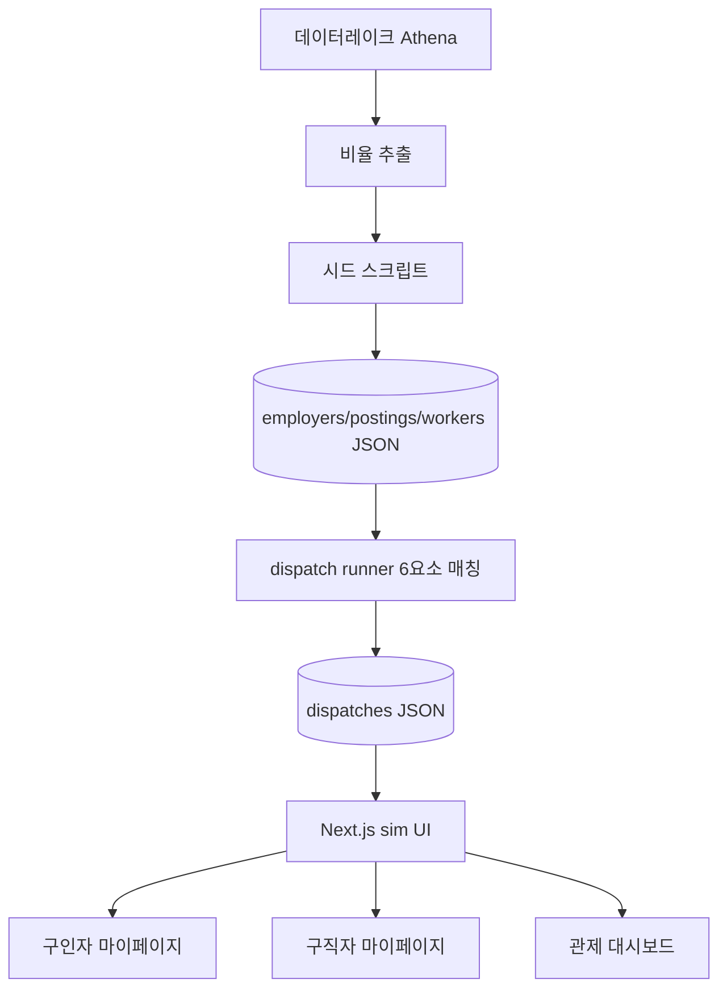
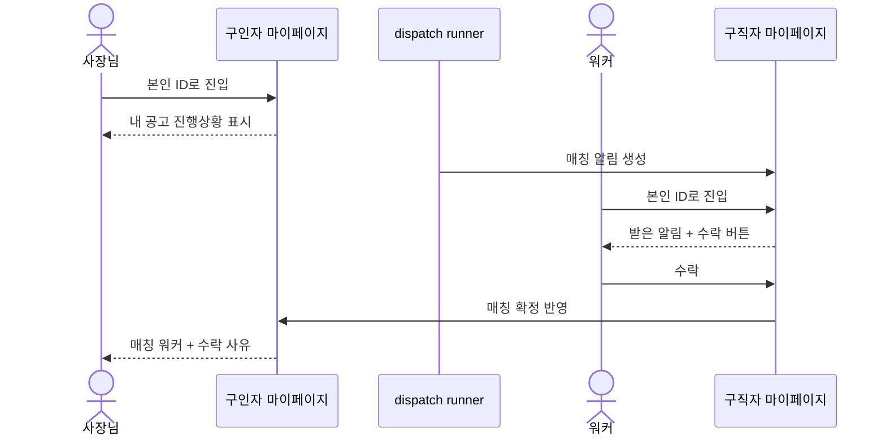

# [PRD] AlbaConnect 강남구 시뮬레이터 - 위치 기반 알바 매칭 검증 환경

**작성일**: 5월 18일

**작성자**: @seokmogu(AI팀)

**스쿼드**: AI팀

---

**담당자**

* PO: @seokmogu
* PD: 미정
* FE: 미정
* BE: 미정

**리뷰 일자**

* 초안 작성: 5월 18일
* 1차 리뷰: 5월 18일 (prd-reviewer)

**완료 일자**: 예정

---

## 0. 이니셔티브 개요

> 💡 **핵심 목표**
> AlbaConnect 시뮬레이터는 매칭 알고리즘 검증 환경 부재 문제를 해결하여, 운영자·구인자·구직자가 "알고리즘이 어떻게 동작하는지 알 수 없는 상태"를 "각자 시점에서 매칭 과정을 직접 확인하는 상태"로 개선한다.

### 핵심 가치

1. **실측 비율 재현**: 알바몬 데이터레이크 강남구 실수치를 축소 비율로 반영
2. **시점 분리**: 구인자·구직자는 마이페이지, 운영자는 관제 대시보드
3. **알고리즘 투명성**: 6요소 매칭 점수와 LLM 수락 사유를 화면에 노출
4. **재현 가능성**: 시드 기반 결정론적 데이터 생성

### Phase 로드맵

| Phase | 목표 | 포함 US |
|-------|------|---------|
| **Phase 1** | 마이페이지 (본인 시점 진입) | US-1 ~ US-4 |
| **Phase 2** | 관제 대시보드 + 워커 가용성 | US-5 ~ US-7, US-10 ~ US-11 |
| **Phase 3** | 분쟁·노쇼 시뮬 | 추후 정의 |

---

## 1. 문제 배경

### 시장 현황

* 위치 기반 초단기 알바 매칭 시장은 알바몬·당근알바 등 기존 채널이 "공고 등록 후 지원 대기" 방식으로 운영된다.
* 강남구 한 개 구에만 알바몬 기준 사업주 18,740개, 활성 공고 33,568건이 존재한다.
* 매칭을 알고리즘으로 자동화하면 응답 지연·노쇼 같은 구조적 문제를 줄일 여지가 있다.

### 타겟 조직의 어려움

* 매칭 알고리즘 개발팀: 6요소 가중 스코어링이 실제 규모(수천 공고 × 만 단위 구직자)에서 어떻게 분포하는지 검증할 환경이 없다.
* 운영팀: 매칭 결과를 이해관계자에게 설명할 시각 자료가 없다.

### 기술적 기회와 시장 공백

* LLM(haiku 등급)으로 사업주 공고·구직자 이력서를 대량 합성해 PII 없는 시뮬 데이터를 만들 수 있다.
* 사내 데이터레이크(Athena)에서 실측 비율을 추출해 시뮬 규모를 현실과 정합하게 맞출 수 있다.

---

## 2. 문제 인식

### 타겟 사용자

1. **구인자(사장님)** - 강남구 자영업 점주, 갑작스러운 결원 충원이 필요
2. **구직자(워커)** - 강남·인접구 거주, 위치 가까운 단기 일감을 찾음
3. **운영자(관리자)** - 매칭 시스템 전체 흐름을 모니터링

### 핵심 문제

#### 문제 1: 본인 시점 화면의 부재

* **상황**: 현재 시뮬레이터의 모든 화면이 관리자가 임의 사업장·워커 ID로 진입하는 구조다.
* **어려움**: 구인자·구직자가 "내 공고", "내 알림"만 보는 진입점이 없어, 실제 서비스 사용 경험을 검증할 수 없다.
* **사례**: "사장님이 자기 매장 매칭 현황만 보고 싶은데 312개 목록에서 찾아 들어가야 한다."

#### 문제 2: 매칭 의사결정의 불투명성

* **상황**: 매칭은 6요소 점수 + LLM 수락 판단으로 결정된다.
* **어려움**: 왜 이 워커가 매칭됐는지, 왜 거절됐는지 점수·사유가 사용자 화면에 드러나지 않으면 알고리즘을 신뢰하기 어렵다.

#### 문제 3: 대규모 데이터의 탐색성

* **상황**: 구직자 9,950명 규모.
* **어려움**: 목록을 한 번에 렌더하면 브라우저가 멈춰 탐색이 불가능하다.

### 근본 원인

1. **관리자 중심 설계**: 초기 구현이 관제 대시보드에서 출발해 개별 사용자 시점이 후순위로 밀렸다.
2. **시뮬 데이터 규모**: 현실 비율을 따르면 구직자가 만 단위가 되어, 페이지네이션·필터 없이는 탐색 불가능하다.

---

## 3. 해결 방안

### 제품 개요

* AlbaConnect 시뮬레이터는 강남구 알바 매칭을 축소 재현하는 웹 애플리케이션이다.
* 사업주·구직자·공고 데이터를 LLM과 시드 RNG로 생성하고, 6요소 매칭 엔진으로 dispatch를 시뮬레이션한 뒤, 세 가지 시점(구인자·구직자·운영자)의 화면으로 결과를 노출한다.

### 차별점

| 항목 | 기존(관제 전용) | 시뮬레이터(목표) |
|------|----------------|------------------|
| 진입 시점 | 관리자만 | 구인자·구직자 본인 시점 마이페이지 추가 |
| 매칭 근거 | 결과만 표시 | 6요소 점수 + LLM 수락 사유 노출 |
| 대규모 탐색 | 전체 일괄 렌더 | 페이지네이션 + 카테고리 필터 |

### 핵심 기능

#### 1. 마이페이지 (본인 시점)

* 구인자 마이페이지: 내 매장 공고 진행상황, 매칭 워커, 수락 사유, KPI
* 구직자 마이페이지: 내가 받은 매칭 알림, 진행 중 일감, 정산 현황
* 진입: 시뮬 환경이므로 ID 선택(로그인 대체)으로 본인 컨텍스트 고정
* 마이페이지는 기존 관리자 시점 화면(`/sim/employer/[id]` 등)을 대체하지 않고, `/sim/me/*` 별도 네임스페이스로 추가한다

#### 2. 관제 대시보드

* 강남구 라이브 지도(사업장·워커·매칭 라인)
* KPI: 사업장·공고·구직자·dispatch·매칭률·평균 매칭 시간
* dispatch 로그, 카테고리 분포

#### 3. 대규모 목록 탐색

* 구직자 목록 페이지네이션(페이지당 60명) + 카테고리 필터

### 기술 접근 방식

**시스템 아키텍처**:

**핵심 기술 요소**:

* claude CLI 헤드리스(haiku): 공고·이력서 합성, 워커 수락 판단
* 6요소 가중 스코어링: 거리 32 / 평점 23 / 직종 18 / 신뢰도 13 / 가용성 8 / 활동성 6
* Next.js App Router: 서버 컴포넌트가 JSON 스냅샷을 읽어 렌더

### 사용자 경험 플로우

---

## 4. 성공 지표

### 핵심 지표

| 지표 | 현재 | 목표 | 측정 방법 |
|------|------|------|-----------|
| 본인 시점 진입 가능 여부 | 불가 (관리자만) | 구인자·구직자 마이페이지 동작 | 화면 접근 테스트 |
| 매칭 근거 노출률 | 결과만 | 점수+사유 100% 노출 | UI 검수 |
| 대규모 목록 응답 시간 | 9,950건 일괄(멈춤) | 페이지당 60건 1초 이내 | 렌더 측정 |

### 제품 지표

* dispatch 매칭률: 95% 이상 유지 (현황: 98%)
* 시뮬 재현성: 동일 시드 → 동일 데이터 100%
* 수락/거절 인터랙션 성공률: 100% (마이페이지 도입 후 측정)

> 📌 평균 매칭 시간(현황 8.6초)은 이미 목표 수준이므로 개선 지표가 아닌 현황 모니터링 항목으로 둔다.

---

## 5. 상위 요구사항

**전체 요구사항**: 구인자·구직자가 본인 시점으로 매칭 과정을 확인하고, 운영자가 전체 흐름을 모니터링할 수 있어야 한다.

---

### Epic 1: 마이페이지 (Phase 1)

* **US-1**: 구인자는 자기 매장 매칭 현황만 보기 위해 본인 시점 마이페이지에 진입할 수 있다
* **US-2**: 구직자는 자기가 받은 매칭 알림만 보기 위해 본인 시점 마이페이지에 진입할 수 있다
* **US-3**: 구직자는 매칭 알림에 대해 수락 또는 거절을 하기 위해 마이페이지에서 의사결정을 할 수 있다
* **US-4**: 사용자는 본인 컨텍스트를 고정하기 위해 ID 기반 진입점을 선택할 수 있다

---

### Epic 2: 관제 대시보드 (Phase 2)

* **US-5**: 운영자는 강남구 매칭 분포를 파악하기 위해 라이브 지도와 KPI를 볼 수 있다
* **US-6**: 운영자는 개별 dispatch를 추적하기 위해 dispatch 로그를 조회할 수 있다
* **US-7**: 사용자는 9,950명 규모 구직자를 탐색하기 위해 페이지네이션과 카테고리 필터를 사용할 수 있다

---

### Epic 4: 워커 가용성 (Phase 2)

* **US-10**: 구직자는 원하는 시점·지역에서만 매칭받기 위해 요일·시간·지역 가용성 스케줄을 설정할 수 있다
* **US-11**: 구직자는 이동 중 어디서든 매칭받기 위해 현재 위치 기반 라이브 매칭을 켤 수 있다

---

### Epic 5: Trust & Safety (Phase 2)

* **US-12**: 워커·사장님은 근로시간을 양측 동의로 기록하기 위해 지오펜스 체크인을 한다
* **US-13**: 워커·사장님은 법적 분쟁을 방지하기 위해 전자 근로 합의서에 상호 동의한다
* **US-14**: 운영자는 노쇼·불량 분쟁을 처리하기 위해 AI 트리아지와 분쟁 준비금을 운용한다

---

### Epic 6: 개인 용역 C2C (Phase 2)

* **US-15**: 개인은 비전문 일상 잡무를 맡기기 위해 용역 의뢰를 등록할 수 있다 — 구현 완료 (`/sim/service` 용역 의뢰 목록 + 7종 카테고리 필터 + 도급 안내 배너). 합의서 모달·위장도급 안내는 후속.

---

### Epic 3: 분쟁·노쇼 시뮬 (Phase 3 — 추후 정의)

> 📌 Phase 3 범위는 Phase 1·2 완료 후 별도 PRD 개정에서 US ID를 부여한다.
> 현재는 방향만 기록하며, US 상세 문서는 작성하지 않는다.

* 노쇼 발생 시뮬 주입 및 차순위 재디스패치 검증
* DisputeTriageAgent 기반 분쟁 1차 트리아지 검증

---

**문서 끝**
