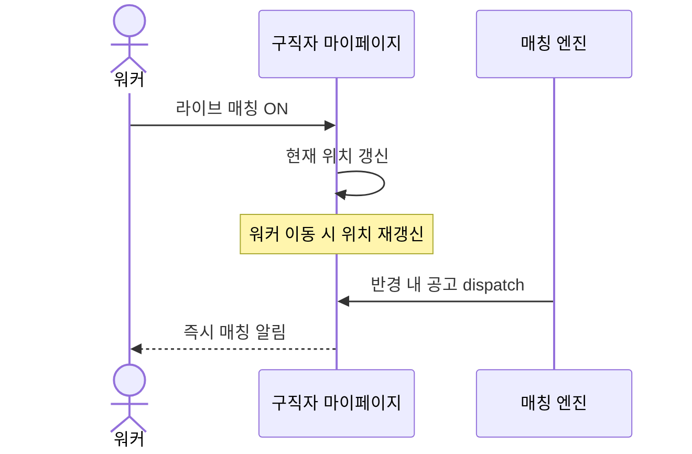

# US-11: 구직자는 이동 중 어디서든 매칭받기 위해 현재 위치 기반 라이브 매칭을 켤 수 있다

**Epic**: Epic 4 - 워커 가용성

**Phase**: Phase 2

**Priority**: P0

**구현 상태**: 미구현

---

## 배경 및 해결하고자 하는 문제

US-10의 예약 스케줄은 워커가 자기 생활 패턴을 미리 알 때 유용하다. 하지만 현실은 즉흥적이다. 워커가 약속이 갑자기 비거나, 외출했다가 시간이 남거나, 평소 안 가던 동네에 갔을 때 — 미리 짠 스케줄에는 그 시점·장소가 없다.

이때 워커가 "지금 나 여기 있고, 일할 수 있어"를 한 번에 켤 수 있어야 한다. 라이브 매칭은 워커의 현재 위치를 기준으로, 스케줄과 무관하게 그 자리 반경 내 공고와 매칭되도록 한다. 워커가 이동하면 위치도 갱신되어, 어디로 가든 그 지역 공고를 받을 준비가 항상 되어 있다.

이 스토리는 워커가 라이브 매칭을 토글하고, 현재 위치가 갱신될 때마다 매칭 후보 판정에 반영되도록 한다.

---

## 기능 요구사항 (Functional Requirements)

### 처리 흐름

### 세부 기능

**1. 라이브 매칭 토글**
워커는 라이브 매칭을 ON/OFF할 수 있다. ON이면 현재 위치 기준 매칭이 활성화된다.

**2. 현재 위치 갱신**
라이브 매칭이 켜진 동안 워커의 현재 위치를 주기적으로(또는 이동 시) 갱신한다. 시뮬 환경에서는 위치를 수동 설정하거나 이동 경로를 시뮬레이션한다.

**3. 라이브 활동 반경**
현재 위치를 중심으로 한 활동 반경 안의 공고만 매칭 후보로 삼는다. 반경은 워커가 조정할 수 있다.

**4. 매칭 반영**
매칭 엔진은 라이브 매칭이 켜진 워커에 대해, 스케줄 규칙과 별개로 현재 위치 반경 내 공고를 후보로 판정한다.

**5. 스케줄과 병행**
라이브 매칭과 예약 스케줄(US-10)은 동시에 켜질 수 있다. 워커는 둘 중 하나라도 부합하면 매칭 후보가 된다 (OR 조건).

---

## 상세 시나리오 (Detailed Scenarios)

### 시나리오 1: 정상 플로우 (Happy Path)

1. 워커가 외출 중 마이페이지에서 라이브 매칭을 ON 한다.
2. 현재 위치가 잡힌다 (시뮬: 수동 설정 또는 이동 시뮬).
3. 그 위치 반경 내 공고가 dispatch되면 워커가 후보에 포함된다.
4. 워커가 다른 동네로 이동하면 위치가 갱신되고, 새 위치 반경 공고를 받는다.

### 시나리오 2: 대체 플로우 (Alternative Flows)

* 라이브 OFF + 스케줄만 ON: US-10 스케줄 기준으로만 매칭.
* 라이브 ON + 스케줄도 ON: 둘 중 하나라도 부합하면 후보 (OR).
* 라이브 ON + 스케줄 없음: 현재 위치 기준으로만 매칭.

### 시나리오 3: 에러 처리 (Error Handling)

* 위치 정보 없음(시뮬에서 미설정): 라이브 매칭은 켜져도 후보 판정에서 제외, 위치 설정 안내.
* 위치 갱신 실패: 마지막 알려진 위치를 일정 시간 유지하되 만료 후 제외.

### 시나리오 4: 엣지 케이스 (Edge Cases)

* 워커가 빠르게 이동 중: 위치 갱신 사이에 들어온 공고는 갱신 직전 위치 기준으로 판정한다.
* 라이브 반경과 스케줄 지역이 겹침: 중복 후보 처리 없이 한 번만 후보로 집계한다.

---

## Business Rules

* **정책**: 가용성 최종 판정 = (스케줄 규칙 부합) OR (라이브 ON & 현재 위치 반경 내). 둘 다 없으면 기존 available 불리언.
* **검증**: 라이브 매칭 ON 시 현재 위치가 있어야 후보 판정에 반영된다.
* **UX 보호**: 라이브 매칭은 "항상 준비" 상태이므로, 켜져 있는 동안 워커가 추가 조작 없이 이동만 해도 매칭 풀이 따라온다.
* **엣지 케이스**: 위치 만료·중복 지역은 명확한 규칙으로 처리한다.

---

## Acceptance Criteria

- [ ] 워커가 라이브 매칭을 ON/OFF할 수 있다
- [ ] 라이브 ON 시 현재 위치 반경 내 공고가 매칭 후보가 된다
- [ ] 워커 위치가 갱신되면 새 위치 기준으로 매칭 후보가 바뀐다
- [ ] 라이브 매칭과 예약 스케줄이 동시에 켜지면 OR 조건으로 후보 판정된다
- [ ] 라이브 ON이지만 위치 정보가 없으면 후보 판정에서 제외되고 위치 설정이 안내된다
- [ ] 라이브 활동 반경을 워커가 조정할 수 있다

---

## 성공 지표 (Success Metrics)

* 라이브 매칭 토글 성공률 100%
* 위치 갱신 → 매칭 후보 반영 정확도 100%
* 스케줄·라이브 OR 조건 판정 정확도 100%

---

## 의존성 및 제약사항

* **선행**: US-2(구직자 마이페이지), US-10(가용성 판정 로직 공유)
* **관련**: 매칭 엔진의 가용성 판정이 US-10·US-11을 통합 처리
* **제약**: 시뮬 환경이라 실제 GPS 대신 위치 수동 설정 또는 이동 경로 시뮬레이션을 사용한다

---

## Definition of Done

- [ ] 라이브 매칭 토글·현재 위치·반경 데이터 모델 정의
- [ ] 마이페이지 라이브 매칭 UI 동작
- [ ] 매칭 엔진의 가용성 판정에 라이브 위치 OR 조건 반영
- [ ] Acceptance Criteria 전 항목 통과
- [ ] TC 작성 및 통과
