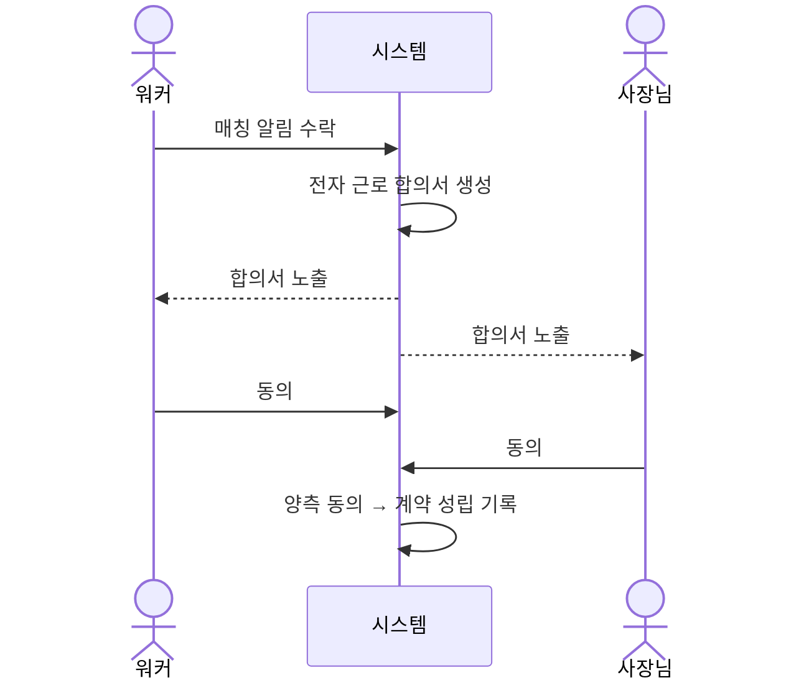

# US-13: 워커·사장님은 법적 분쟁을 방지하기 위해 전자 근로 합의서에 상호 동의한다

**Epic**: Epic 5 - Trust & Safety

**Phase**: Phase 2

**Priority**: P0

**구현 상태**: 미구현

---

## 배경 및 해결하고자 하는 문제

초단기·건당 알바도 근로계약서 작성은 법적 의무다 (`Legal_Considerations.md` §1.1). 현재 시뮬은 매칭이 확정되면 곧바로 일이 시작되는데, 근로조건(시급·시간·장소·업무)에 대한 명시적 합의 기록이 없다.

근로조건이 문서로 합의되지 않으면 — "시급이 얼마라고 했다", "몇 시까지라고 했다" 같은 분쟁이 그대로 발생한다. 양측이 매칭 시점에 동일한 근로조건을 보고 동의한 기록이 있으면, 분쟁의 사실 다툼 대부분이 사라진다.

이 스토리는 매칭 확정 시 전자 근로 합의서를 양측에 노출하고, 양쪽이 동의해야 매칭이 최종 확정되도록 한다.

---

## 기능 요구사항 (Functional Requirements)

### 처리 흐름

### 세부 기능

**1. 합의서 자동 생성**
매칭 확정 시 공고·매칭 정보로 전자 근로 합의서를 생성한다.

**2. 합의서 필수 항목**
사업장명·워커명, 근무 일시·시간, 근무 장소, 업무 내용, 시급·총액·정산 방식, 고용형태, 취소·노쇼 규정 요약, 플랫폼 중개자 지위 명시.

**3. 양측 동의 게이트**
양쪽이 모두 동의해야 매칭이 최종 확정된다. 한쪽만 동의하면 보류 상태.

**4. 변경 불가 기록**
동의 시각·합의서 내용을 변경 불가 기록으로 보관한다. 분쟁 시 근거가 된다.

**5. 미동의 시 차단**
합의서 미동의 상태로는 체크인(US-12)을 할 수 없다.

---

## 상세 시나리오 (Detailed Scenarios)

### 시나리오 1: 정상 플로우

1. 워커가 매칭 알림을 수락한다.
2. 전자 근로 합의서가 화면에 노출된다 (시급·시간·장소·업무 명시).
3. 워커가 합의서를 확인하고 동의한다.
4. 사장님도 동의하면 계약이 성립되고 매칭이 확정된다.

### 시나리오 2: 대체 플로우

* 워커만 동의·사장님 미동의: 계약 보류, 사장님 동의 대기 표시.
* 합의서 내용에 이견: 동의 거부 → 매칭 무산, 차순위 재디스패치.

### 시나리오 3: 에러 처리

* 합의서 생성 실패: 매칭 보류, 재시도 안내.

### 시나리오 4: 엣지 케이스

* 한쪽이 장시간 미동의: 일정 시간 후 매칭 만료 처리.

---

## Business Rules

* **정책**: 양측 동의 없이는 계약 미성립. 미동의 시 체크인·근무 불가.
* **검증**: 합의서 필수 항목이 모두 채워졌는지 확인.
* **법적**: 플랫폼은 중개자이며 근로계약 당사자는 사업주·워커임을 합의서에 명시.
* **기록**: 동의 시각·내용은 변경 불가. 분쟁 근거로 5년 보관 (전자상거래·노동 관계 법령).

---

## Acceptance Criteria

- [ ] 매칭 수락 시 전자 근로 합의서가 생성·노출된다
- [ ] 합의서에 필수 8개 항목이 모두 표시된다
- [ ] 양측이 모두 동의해야 매칭이 최종 확정된다
- [ ] 한쪽만 동의하면 보류 상태로 표시된다
- [ ] 동의 시각·합의서 내용이 변경 불가 기록으로 보관된다
- [ ] 합의서 미동의 상태에서는 체크인이 차단된다

---

## 성공 지표 (Success Metrics)

* 매칭 건당 합의서 생성률 100%
* 양측 동의 완료율 (목표 95%+)
* 근로조건 관련 분쟁 비율 감소

---

## 의존성 및 제약사항

* **선행**: US-3(매칭 수락)
* **관련**: US-12(체크인)은 합의서 동의 후 가능, US-14(분쟁)는 합의서를 근거로 활용
* **제약**: 시뮬 환경에서는 합의서 동의가 세션 메모리. 합의서 양식은 노무사 검토 전 초안

---

## Definition of Done

- [ ] 합의서 생성·노출·동의 UI 동작
- [ ] Acceptance Criteria 전 항목 통과
- [ ] 미동의 시 체크인 차단 확인
- [ ] TC 작성 및 통과
