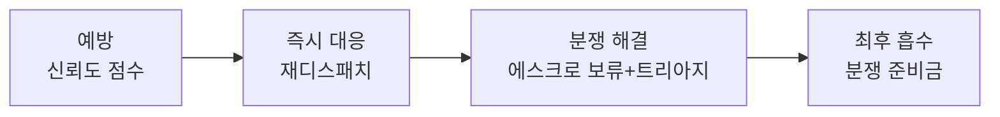

# US-14: 운영자는 노쇼·불량 분쟁을 처리하기 위해 AI 트리아지와 분쟁 준비금을 운용한다

**Epic**: Epic 5 - Trust & Safety

**Phase**: Phase 3

**Priority**: P1

**구현 상태**: 미구현

---

## 배경 및 해결하고자 하는 문제

노쇼·불량 노동으로 손실이 발생하면 한쪽에 100% 책임을 지울 수 없다 — 그쪽이 이탈한다. 책임을 "전가"가 아니라 "4단 분산"해야 한다 (`Operations_Policy.md` §4).

이 스토리는 운영자가 분쟁을 예방→즉시대응→해결→흡수의 4단계로 처리하도록 한다.

---

## 기능 요구사항 (Functional Requirements)

### 4단 분산 처리

### 세부 기능

**1. 워커 노쇼 — 예방·즉시 대응**
노쇼 워커는 신뢰도 점수가 하락하고, 차순위 워커에게 자동 무료 재디스패치된다.

**2. 사장님 부당 — 워커 보호**
워커 체크인 기록이 있으면 도착 보장(최소 시간분). 에스크로 예치금으로 미지급 차단.

**3. 불량 노동 — 에스크로 보류 + 트리아지**
사장님이 불량 신고 → 에스크로 정산 보류 → `DisputeTriageAgent` 1차 분류(우선순위·권장 조치) → 운영자 검토 → 부분/전액/기각.

**4. 분쟁 준비금**
명백한 과실은 당사자 부담, 모호한 케이스는 플랫폼 분쟁 준비금으로 흡수. 재원은 take rate 일부 적립.

**5. 합의서 근거 활용**
분쟁 처리 시 전자 근로 합의서(US-13)와 체크인 기록(US-12)을 사실 근거로 사용한다.

---

## 상세 시나리오 (Detailed Scenarios)

### 시나리오 1: 워커 노쇼

1. 공고 시작 시각 + 유예시간까지 체크인 없음 → 노쇼 판정.
2. 차순위 워커에게 자동 재디스패치.
3. 노쇼 워커 신뢰도 점수 하락.

### 시나리오 2: 불량 노동 분쟁

1. 사장님이 "불량" 신고 → 에스크로 정산 보류.
2. DisputeTriageAgent가 양측 진술·합의서·체크인 기록으로 1차 분류.
3. 운영자가 검토 후 부분/전액/기각 결정.

### 시나리오 3: 에러·엣지

* 양측 진술 정면 충돌: humanReviewRequired, 운영자 직접 처리.
* legalRisk 높음(성희롱·폭행 등): 즉시 에스컬레이션.

---

## Business Rules

* **정책**: 책임은 전가가 아니라 4단 분산. 최종 결정은 운영자.
* **재원**: 분쟁 준비금은 take rate 일부 적립.
* **근거**: 합의서·체크인 기록을 분쟁 사실 판단의 1차 근거로.

---

## Acceptance Criteria

- [ ] 노쇼 판정 시 차순위 워커로 자동 재디스패치된다
- [ ] 노쇼 워커의 신뢰도 점수가 하락한다
- [ ] 불량 신고 시 에스크로 정산이 보류되고 AI 트리아지 결과가 생성된다
- [ ] 운영자가 부분/전액/기각을 결정할 수 있다
- [ ] 모호한 손실은 분쟁 준비금으로 흡수된다
- [ ] 분쟁 처리에 합의서·체크인 기록이 근거로 표시된다

---

## 성공 지표 (Success Metrics)

* 노쇼 시 재디스패치 성공률
* 분쟁 평균 처리 시간 (목표 24시간 이내)
* 분쟁 준비금 소진율 (지속가능 범위)

---

## 의존성 및 제약사항

* **선행**: US-12(체크인), US-13(합의서), DisputeTriageAgent
* **제약**: 시뮬 Phase 3 대상. 분쟁 준비금 회계는 `business-analysis.md` 단가 모델과 연동 필요.

---

## Definition of Done

- [ ] 노쇼 재디스패치·신뢰도 하락 동작
- [ ] 불량 분쟁 트리아지·에스크로 보류 동작
- [ ] Acceptance Criteria 전 항목 통과
- [ ] TC 작성 및 통과
