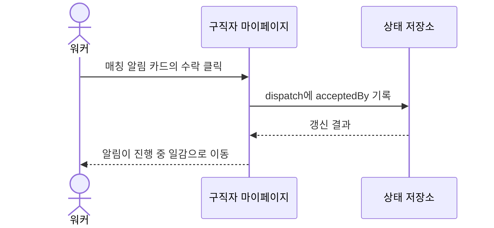

# US-3: 구직자는 매칭 알림에 대해 수락 또는 거절을 하기 위해 마이페이지에서 의사결정을 할 수 있다

**Epic**: Epic 1 - 마이페이지

**Phase**: Phase 1

**Priority**: P0

**구현 상태**: 미구현

---

## 배경 및 해결하고자 하는 문제

현재 시뮬레이터에서 워커의 수락/거절은 dispatch runner가 LLM으로 일괄 결정한다. 사람이 직접 마이페이지에서 알림을 보고 수락·거절하는 인터랙션이 없다.

실제 서비스에서 워커는 매칭 알림을 받으면 제한 시간 안에 수락 여부를 판단한다. 이 의사결정 경험이 시뮬에 빠져 있어, 마이페이지의 핵심 인터랙션을 검증할 수 없다.

이 스토리는 구직자 마이페이지에서 워커가 받은 알림에 대해 직접 수락 또는 거절하고, 그 결과가 본인 일감과 구인자 화면에 반영되도록 한다.

---

## 기능 요구사항 (Functional Requirements)

### 처리 흐름

### 세부 기능

**1. 수락/거절 버튼**
각 매칭 알림 카드에 수락·거절 버튼을 제공한다.

**2. 수락 처리**
수락 시 해당 dispatch가 본인 진행 중 일감으로 이동하고, 알림 목록에서 사라진다.

**3. 거절 처리**
거절 시 해당 알림이 목록에서 사라지고, 진행 중 일감에는 추가되지 않는다.

**4. 결정 시간 표기**
알림 카드에 의사결정 제한 시간 맥락(예: "30초 안 결정")을 표시한다.

---

## 상세 시나리오 (Detailed Scenarios)

### 시나리오 1: 정상 플로우 (Happy Path)

1. 워커가 마이페이지의 새 매칭 알림 카드에서 수락을 누른다.
2. 해당 알림이 사라지고 진행 중 일감 영역에 예상 정산액과 함께 추가된다.
3. 구인자 마이페이지에 매칭 확정으로 반영된다.

### 시나리오 2: 대체 플로우 (Alternative Flows)

* 거절: 알림이 사라지고 진행 중 일감에는 추가되지 않는다.
* 동일 공고에 여러 워커가 알림을 받은 경우: 먼저 수락한 워커로 매칭이 확정되고 나머지는 알림이 만료된다.

### 시나리오 3: 에러 처리 (Error Handling)

* 이미 다른 워커가 수락한 공고를 수락 시도: "이미 매칭 완료된 공고입니다" 안내 후 알림 제거.
* 상태 저장 실패: 사용자에게 재시도 안내, 알림은 목록에 유지.

### 시나리오 4: 엣지 케이스 (Edge Cases)

* 결정 제한 시간 초과 알림: 만료 처리해 목록에서 제거한다.

---

## Business Rules

* **정책**: 한 공고는 첫 수락 워커에게 확정된다. 이후 수락은 거부된다.
* **검증**: 수락 시 해당 dispatch가 미확정 상태인지 확인한다.
* **UX 보호**: 수락/거절 후 즉시 피드백을 주어 워커가 결과를 인지하게 한다.
* **엣지 케이스**: 만료 알림은 워커가 조작하기 전에 자동 제거한다.

---

## Acceptance Criteria

- [ ] 매칭 알림 카드에 수락·거절 버튼이 있다
- [ ] 수락 시 알림이 진행 중 일감으로 이동한다
- [ ] 거절 시 알림이 제거되고 일감에 추가되지 않는다
- [ ] 이미 매칭된 공고 수락 시도 시 안내 후 알림이 제거된다
- [ ] 수락 결과가 구인자 마이페이지에 매칭 확정으로 반영된다
- [ ] 알림 카드에 의사결정 제한 시간 맥락이 표시된다

---

## 성공 지표 (Success Metrics)

* 수락/거절 인터랙션 성공률 100%
* 수락 후 구인자 화면 반영 정확도 100%
* 중복 수락 차단율 100%

---

## 의존성 및 제약사항

* **선행**: US-2(구직자 마이페이지)
* **관련**: US-1(구인자 마이페이지)에 결과 반영
* **제약**: 수락/거절 상태는 세션 메모리에 저장하며, 새로고침 시 `dispatches.json` 스냅샷 기준으로 리셋된다. 실시간 동시성보다 결정론적 재현을 우선한다

---

## Definition of Done

- [ ] 수락/거절 인터랙션 동작
- [ ] Acceptance Criteria 전 항목 통과
- [ ] 중복 수락·만료 처리 확인
- [ ] TC 작성 및 통과
