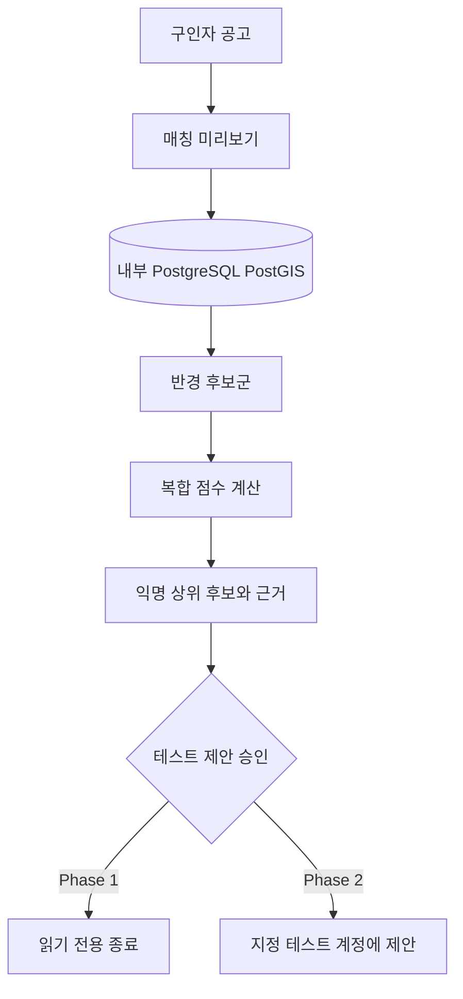
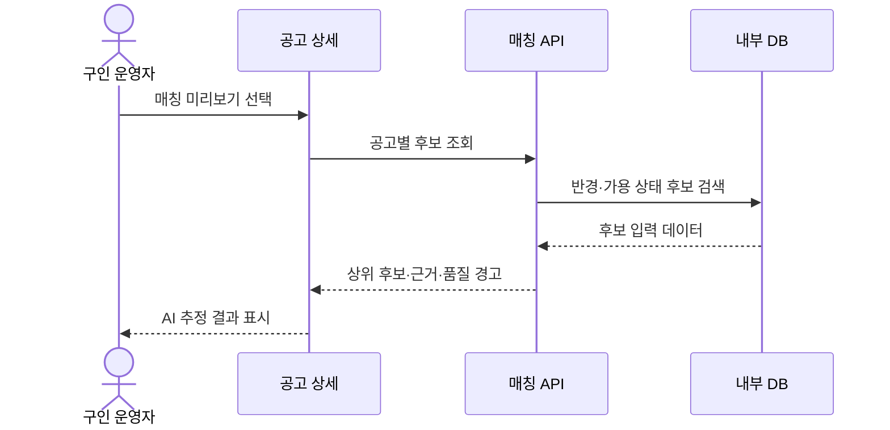

# [PRD] 알바커넥트 - 내부 DB 매칭 검증 베타

**작성일**: 2026년 8월 6일

**작성자**: AlbaConnect Product Team

---

**담당자**

* PO: 미정
* PD: 미정
* FE: AlbaConnect Web
* BE: AlbaConnect API

**리뷰 상태**

* 초안 작성: 2026년 8월 6일
* 1차 리뷰: 예정

**완료 일자**: 예정

---

## 0. 이니셔티브 개요

> 💡 **핵심 목표**
> 알바몬 커넥트는 결제·정산 기능 없이 내부 DB의 공고와 구직자 데이터를 사용해, 어떤 구직자가 왜 상위 매칭 후보가 되었는지 운영자가 확인하고 실제 제안 흐름까지 검증하게 한다.

### 핵심 가치

1. **실데이터 기반**: 화면용 고정 목록이 아니라 PostGIS에 저장된 공고·구직자 상태로 후보를 계산한다.
2. **설명 가능한 추천**: 거리, 직종, 평점, 이력, 활동성, 가용성의 영향을 후보별로 확인한다.
3. **안전한 베타**: 결제·정산 및 금전 상태 변경을 검증 범위에서 제외한다.
4. **행동 가능한 검증**: 후보가 많다는 사실보다 추천 순서가 실제 채용 판단에 유용한지를 측정한다.

### Phase 로드맵

| Phase | 목표 | 포함 US |
|---|---|---|
| **Phase 1** (현재) | 내부 DB 후보 탐색·순위·근거 검증 | US-1 ~ US-5 |
| **Phase 2** | 테스트 계정으로 제안·수락·거절 흐름 검증 | US-6 ~ US-8 |
| **Phase 3** | 운영 데이터 피드백으로 가중치 보정 | US-9 ~ US-10 |

---

## 1. 문제 배경

### 시장 현황

* 단기 채용은 근무지와 출근 시점이 고정되어 있어 거리와 즉시성이 일반 채용보다 중요하다.
* 추천 결과가 많아도 출근 가능 시간이나 직종 적합성이 낮으면 구인자의 확인 비용만 증가한다.

### 타겟 조직의 어려움

* **구인 운영자**: 공고를 등록한 뒤 실제로 적합한 후보가 존재하는지 배차 전에는 확인하기 어렵다.
* **매칭 운영자**: 결과 순위만 보고는 데이터 부족인지 알고리즘 문제인지 구분하기 어렵다.
* **제품팀**: 단위 테스트 통과와 실제 DB에서 의미 있는 추천이 나오는지를 별도로 검증할 수 없다.

### 기술적 기회와 시장 공백

* PostGIS에 공고·구직자 위치가 있어 반경 내 후보군을 실제 데이터로 계산할 수 있다.
* 현재 내부 DB에는 공고와 구직자가 충분하지만, 가용 시간과 최근 활동 이력은 별도 품질 검증이 필요하다.

---

## 2. 문제 인식

### 타겟 사용자

1. **구인 운영자** - 공고별로 제안할 만한 후보가 있는지 빠르게 판단한다.
2. **매칭 운영자** - 후보 순위와 데이터 품질을 함께 보고 알고리즘을 검증한다.
3. **제품팀** - 베타 사용 결과로 다음 개발 범위를 결정한다.

### 핵심 문제

#### 문제 1: 후보 수와 매칭 품질이 혼동된다

* **상황**: 반경 안에 수천 명의 후보가 존재한다.
* **어려움**: 후보가 많아도 직종·시간·최근 활동 정보가 부족하면 실제 제안 성공 가능성을 알 수 없다.
* **사례**: "5km 안에 후보는 많은데 지금 출근 가능한 사람인지 모르겠다."

#### 문제 2: 추천 결과의 이유가 보이지 않는다

* **상황**: 시스템이 점수로 후보를 정렬한다.
* **어려움**: 거리 외 요소가 순위에 어떻게 반영됐는지 알 수 없어 결과를 신뢰하거나 조정하기 어렵다.
* **사례**: "1순위가 왜 1순위인지 설명할 수 없다."

#### 문제 3: 추천과 실제 제안 성공이 분리되어 있다

* **상황**: 후보 계산 후 온라인 연결 상태에 따라 제안이 전달된다.
* **어려움**: DB 후보가 존재해도 접속 중인 테스트 구직자가 없으면 제안·응답 검증이 끝나지 않는다.
* **사례**: "후보 조회는 되지만 수락까지 연결되는지는 확인하지 못했다."

### 근본 원인

1. **데이터 품질 미계측**: 위치·직종·평점·가용성·활동성의 채움률이 한 화면에 드러나지 않는다.
2. **설명 계층 부재**: 총점만으로는 후보군 생성과 최종 순위를 구분할 수 없다.
3. **검증 단계 혼합**: DB 추천 품질, 실시간 전달, 수락 완료를 하나의 성공으로 취급한다.

---

## 3. 해결 방안

### 제품 개요

* 구인자는 자신이 등록한 공고 상세에서 결제 없이 `매칭 미리보기`를 실행한다.
* 시스템은 내부 DB에서 반경 조건을 만족하는 후보를 찾고, 상위 후보의 종합 점수와 핵심 근거를 `AI 추정`으로 표시한다.
* 운영자는 후보 수, 데이터 품질 경고, 상위 후보 근거를 확인한 뒤 테스트 제안을 별도 단계로 실행한다.

### 차별점

| 항목 | 기존 확인 방식 | 내부 DB 매칭 검증 베타 |
|---|---|---|
| 후보 확인 | 제안을 실행한 뒤 로그 확인 | 제안 전 읽기 전용 미리보기 |
| 결과 근거 | 종합 점수 중심 | 점수 구성과 데이터 부족 경고 동시 표시 |
| 검증 단위 | 추천·전달·수락 혼합 | 후보 탐색 → 순위 → 전달 → 응답 단계 분리 |
| 금전 기능 | 에스크로 화면과 함께 노출 | 결제·정산 완전 제외 |

### 핵심 기능

#### 1. 공고별 매칭 미리보기

* 반경, 직종, 가용 상태를 적용한 실제 후보 수를 표시한다.
* 상위 후보는 개인정보 없이 순번과 익명 참조값으로 표시한다.
* 미리보기는 지원·알림·DB 상태를 변경하지 않는다.

#### 2. 설명 가능한 후보 카드

* 거리, 직종 일치, 평점, 완료·노쇼 이력, 최근 활동, 가용성 근거를 표시한다.
* 모델 또는 규칙 기반 추천 결과에는 `AI 추정` 라벨을 표시한다.
* 입력 데이터가 없으면 점수처럼 보이게 숨기지 않고 `정보 부족`으로 표시한다.

#### 3. 데이터 품질 상태

* 위치 보유율, 직종 보유율, 최근 활동률, 가용 시간 등록률을 분리한다.
* 후보 과다, 최근 활동 0건, 가용 시간 0건은 추천 품질 경고로 노출한다.

#### 4. 단계형 실제 제안 검증

* Phase 1은 읽기 전용 후보 미리보기까지만 포함한다.
* Phase 2는 지정한 테스트 구직자 계정의 온라인 연결과 수락·거절 결과를 검증한다.
* 실사용자 알림, 결제, 정산은 명시적 운영 승인 전 실행하지 않는다.

### 기술 접근 방식

### 사용자 경험 플로우

---

## 4. 성공 지표

### 핵심 지표

| 지표 | 현재 | 목표 | 측정 방법 |
|---|---:|---:|---|
| 표본 공고 후보 조회 성공률 | 20/20, 빈 결과 0건 | 100% | open 공고 100건 스모크 |
| 표본 공고 평균 후보 수 | 5,646.2명 | 운영 가능 구간 정의 | 공고별 5km 후보 수 |
| 상위 5명 직종 일치율 | 100% | 80% 이상 | 공고별 상위 5명 category 일치 |
| 추천 근거 완전 표시율 | 100% | 100% | 상위 후보 점수 구성 표시 |
| 최근 7일 활동 데이터 보유율 | 0% | 70% 이상 | worker_profiles.last_seen_at 집계 |
| 가용 시간 등록률 | 0% | 70% 이상 | worker_availability 등록 구직자 비율 |
| 완료·노쇼 이력 보유율 | 0% | 기준선 확보 | job_applications 상태 집계 |

### 제품 지표

* 공고 상세에서 매칭 미리보기 완료율: 90% 이상
* 결과 확인 후 운영자 `추천 적절` 응답률: 70% 이상
* 빈 결과에 원인과 다음 행동이 표시되는 비율: 100%

### 비즈니스 지표

* Phase 2 테스트 제안 수락률: 기준선 확보 후 목표 설정
* 공고 등록부터 첫 수락까지 걸린 시간: 기준선 확보 후 목표 설정

### 2026년 8월 6일 내부 DB 기준선 해석

* 읽기 전용 스모크는 최근 등록된 open 공고 20건을 대상으로 실행했다.
* 후보 탐색과 직종 우선 정렬은 동작했지만, 20건 모두 데이터 신뢰도 `낮음`으로 판정됐다.
* 최근 활동, 가용 시간, 완료·노쇼 이력이 전부 0%라 상위 점수는 사실상 거리·직종·평점 중심이다.
* 표본 open 공고의 근무 시작일이 모두 현재보다 과거여서, 이 결과는 **내부 시뮬레이션 데이터의 알고리즘 동작 확인**이지 실제 수락 가능성 검증이 아니다.
* Phase 2에 들어가기 전에 미래 날짜 테스트 공고, 최근 활동이 있는 테스트 구직자, 가용 시간, 완료 이력을 포함한 고정 검증 세트를 마련한다.

---

## 5. 상위 요구사항

**전체 요구사항**: 운영자는 금전 기능 없이 내부 DB의 실제 후보를 확인하고, 추천 근거와 데이터 품질을 바탕으로 매칭 가능성을 판단할 수 있어야 한다.

### Epic 1: 후보 탐색 (Phase 1)

* **US-1**: 구인 운영자는 공고의 실제 반경 후보 수를 확인할 수 있다.
* **US-2**: 구인 운영자는 상위 후보를 개인정보 없이 확인할 수 있다.

### Epic 2: 추천 설명 (Phase 1)

* **US-3**: 매칭 운영자는 후보별 점수 구성과 순위 이유를 확인할 수 있다.
* **US-4**: 매칭 운영자는 추천에 영향을 주는 데이터 부족을 확인할 수 있다.
* **US-5**: 제품팀은 표본 공고의 추천 결과를 반복 가능한 방식으로 측정할 수 있다.

### Epic 3: 실제 제안 (Phase 2)

* **US-6**: 운영자는 지정된 테스트 구직자에게만 제안을 보낼 수 있다.
* **US-7**: 테스트 구직자는 제안을 수락하거나 거절할 수 있다.
* **US-8**: 운영자는 후보 조회, 전달, 응답 결과를 단계별로 확인할 수 있다.

### Epic 4: 알고리즘 보정 (Phase 3)

* **US-9**: 제품팀은 운영자 평가와 수락 결과를 기준으로 가중치를 비교할 수 있다.
* **US-10**: 제품팀은 변경 전후 추천 품질을 동일 표본으로 재검증할 수 있다.

---

## 범위 제외

* Toss 결제 승인, 에스크로 예치, 정산, 환불
* 실제 구직자 대상 대량 알림
* 외부 공개 서비스 SLA와 고가용성 구성
* 법률·노무 정책의 최종 확정

---

## 내부 레퍼런스와 본 기획의 차이

> 📌 **참조 원칙**
> 아래 문서는 같은 문제 영역에서 먼저 검토된 내부 자산이다. 알바커넥트는 이 과제들의 후속 통합안으로 전제하지 않고, **공고 탐색·지원 중심이 아닌 시간·장소·가용성 기반 제안·수락 경험이 실제로 유효한지 확인하는 별도 접근**으로 검증한다.

| 내부 레퍼런스 | 참고할 지점 | 알바커넥트가 다르게 검증할 지점 |
|---|---|---|
| [AM 성과형 End-Picture](https://app.notion.com/p/3357d8322b04802b830cfb3172ead3d7) | 긴급도와 시간 약속을 기준으로 매칭 성과를 정의 | 적합 지원자 수가 아니라 특정 근무 슬롯의 제안·응답·확정 경험을 검증 |
| [바로출근 채용관 PRD](https://app.notion.com/p/33d7d8322b0481399793cfa686bfd4f1) | 구직자의 빠른 출근 가능 상태와 기업의 빠른 채용 의사 | 채용관 탐색·지원 대신 가용 상태를 매칭 입력으로 사용 |
| [알바몬 제트 매칭 시점](https://app.notion.com/p/32c7d8322b048162af1dc2ca8785a15e) | 위치·반경·조건 변화에 따른 재매칭 | 추천 노출보다 제안 이후 짧은 응답과 상태 전이를 중심으로 검증 |
| [HireNow PRD](https://app.notion.com/p/32b7d8322b0481cdaafbd0c7a1521a96) | 기업 주도 후보 탐색과 제안 자동화 | 대규모 채용 운영이 아니라 한 개의 시간·장소 슬롯 충원 경험을 검증 |
| [공고 제안 화면 PRD](https://app.notion.com/p/9d87d8322b0482aca6b381c15dfee47f) | 제안 수신·비교·수락 UX | 수락을 지원 생성이 아닌 근무 슬롯 확정 가설로 분리해 검증 |

## 사내 목업 체험

* **실시간 3자 관점 데모**: [http://172.16.110.192:3000/sim/demo](http://172.16.110.192:3000/sim/demo)
* **접속 조건**: 동일 사내망에서 접근하며, 현재 POC 호스트와 Podman 컨테이너가 실행 중이어야 한다.
* **확인 가능**: 구인자 등록 → 조건 기반 매칭 → 워커 제안 → 수락 → 관리자 상태 변화의 3분할 목업 흐름
* **데모 데이터**: 합성 사업장 312개, 합성 구직자 9,950명, dispatch 624건
* **확인 불가**: 실제 알바몬 DB 매칭 품질, 실사용자 제안 전달, 실제 근무 확정, 결제·정산
* **운영 성격**: 방향성 공유용 임시 사내 POC이며 외부 공개 또는 상시 가용성을 보장하지 않는다.
